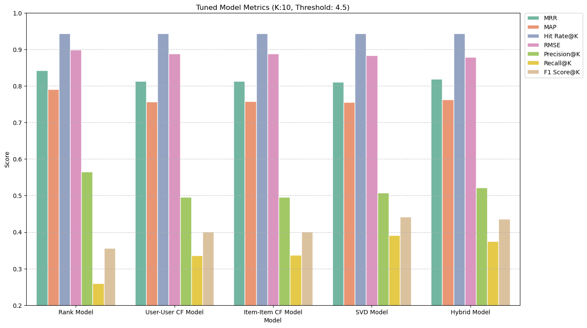

# Product Recommendation System For Amazon


## Executive Summary

In the competitive e-commerce industry, enhancing customer satisfaction and driving sales through personalized recommendations are critical for success. This project addresses the challenges of data sparsity, positive rating bias, and the cold start problem by developing a robust recommendation system using Amazon’s electronic product reviews dataset.

**Key Outcomes**
- **Best Model**: The hybrid model provided the most balanced performance, with RMSE at 0.879 and Precision@10 at 0.522, offering the best trade-off between accuracy, diversity, and relevance.
- **Key Insights**: Data sparsity (78,798 interactions out of 10 million possibilities) and positive rating bias (82% of ratings ≥ 4) skew recommendations toward popular items, limiting diversity. These challenges restrict diversity, favor popular items, and hinder the system’s ability to provide personalized suggestions for less common preferences.
- **Cold Start Mitigation**: The Hybrid Model effectively tackled the cold start challenge by leveraging a rank-based approach, enabling personalized recommendations for new users and products despite sparse interaction data.

**Business Impact**
- **Enhanced Engagement**: Personalized recommendations boost customer satisfaction and retention.
- **Increased Sales**: Relevant suggestions drive higher conversion rates and average order values.
- **Optimized Efficiency**: Streamlined strategies improve resource allocation and business outcomes.

**Actionable Recommendations**
- **Integrate Metadata**: Enhance the system with content-based filtering using product descriptions, categories, and brands to address data sparsity and cold start challenges.
- **Expand Data Sources**: Leverage implicit feedback like clicks and cart additions to reduce reliance on popular items, thereby enhancing model accuracy and recommendation diversity.
- **Optimize Diversity**: Use weighted sampling, coverage and novelty metrics to promote lesser-known products and cater to underrepresented users.
- **Implement A/B Testing**: Continuously refine strategies using CTR, AOV, and CLV as key indicators.
- **Personalize Product Promotions**: Use targeted marketing campaigns to promote a mix of top-selling and niche products, balancing popularity and diversity to drive customer engagement and satisfaction.

## Table of Contents

- [Introduction](#introduction)
- [Objective](#objective)
- [Key Business Metrics](#key-business-metrics)
- [Exploratory Data Analysis](#exploratory-data-analysis)
- [Data Insights](#data-insights)
- [Models’ Performance](#models-performance)
- [Business Recommendations](#business-recommendations)
- [Repository Structure](#repository-structure)
- [Requirements](#requirements)
- [Installation](#installation)

## Introduction
In the competitive e-commerce landscape, personalized product recommendations are crucial for enhancing customer experience, increasing engagement, and driving sales. Platforms like Amazon, Walmart, and Etsy rely on advanced recommendation engines to improve customer retention and streamline decision-making. This project focuses on developing a recommendation system using Amazon's product reviews dataset, specifically for electronic products. The dataset includes product ratings but excludes additional information or reviews to maintain an unbiased model-building process.

## Objective
The objective is to build a recommendation system to suggest products to Amazon customers based on their previous ratings. By utilizing a labeled dataset of Amazon product reviews, the project aims to extract meaningful insights and develop models that enhance product recommendations for online consumers. Several approaches are explored, including:

- **Knowledge/Rank-Based Recommendation System**: Recommends popular items to all users based on predefined criteria, aiding new users without personalization.
- **User-User Collaborative Filtering**: Suggests products liked by users with similar preferences by focusing on user-to-user similarities.
- **Item-Item Collaborative Filtering**: Recommends items similar to those a user has interacted with by analyzing item-to-item similarities.
- **Matrix Factorization-Based Collaborative Filtering**: Uses matrix factorization to uncover latent factors in user-item interactions for personalized recommendations.
- **Hybrid Recommendation System**: Combines multiple recommendation techniques to enhance accuracy and relevance in a hybrid system.

## Key Business Metrics

**Predictive Metrics**
- **Root Mean Squared Error (RMSE)**: Measures the accuracy of the model's rating predictions. Lower RMSE values indicate better performance.
- **Precision@K**: The fraction of relevant items within the top K recommendations, indicating the model's effectiveness in recommending engaging products.
- **Recall@K**: The proportion of all relevant items included in the top K recommendations, reflecting the model's ability to capture diverse user preferences.
- **F1 Score@K**: The harmonic mean of Precision@K and Recall@K, providing a balanced measure of the model's predictive performance.

**Ranking Metrics**
- **Mean Reciprocal Rank (MRR)**: Measures the ranking quality by averaging the reciprocal rank of the first relevant item in the recommended list.
- **Mean Average Precision (MAP)**: Assesses the average precision across all users, indicating how well the model ranks relevant items.
- **Hit Rate@K**: The proportion of cases where at least one relevant item appears in the top K recommendations.

## Exploratory Data Analysis

1. **Data Cleaning and Preprocessing**: Addressed missing values and ensured data integrity for accurate model building.
2. **Descriptive Statistics**: Summarized data to understand user behavior, product popularity, and rating distributions.
3. **Univariate Analysis**: Examined individual features, identifying trends and patterns in user-product interactions.
5. **Visualizations**: Utilized charts and graphs to uncover insights, including rating distribution and user engagement patterns.

## Data Insights
This project analyzed and compared multiple recommendation models using the Amazon product reviews dataset focused on electronic products. The evaluation revealed that data sparsity, overfitting, and the dominance of popular items significantly impacted the models' performance.

- **Data Sparsity**: The dataset contains only 78,798 recorded interactions out of a possible 10 million user-product combinations, leading to a highly sparse matrix. This limits the ability to capture diverse preferences and often results in less personalized recommendations.
- **Positive Rating Bias**: Over 82% of ratings are 4 or higher, creating a skew towards positive feedback that complicates model generalization and reduces the system’s ability to discern finer differences in user preferences.
- **Right-Skewed Interactions**: The majority of users have between 10 to 50 interactions, and most products are rated by only 1 to 10 users. However, a small subset of users and products dominate the interactions, introducing potential bias in model training and skewing recommendations toward these frequent users and popular products.
- **Impact on Metrics**: Data sparsity and positive rating bias cause models to favor frequently and highly rated items, inflating metrics like Precision@K, MRR, MAP, and Hit Rate@K. This results in overfitting and lowers Recall@K by missing less common but relevant items.
- **Cold Start Problem**: Both new users and newly launched or rarely rated products struggle to gain visibility due to models' reliance on past interactions, exacerbating the cold start problem for these items.

## Models’ Performance

The following models were evaluated to determine the best approach for product recommendations:

1. **Rank-Based Recommendation System**: 
   - **Performance**: Achieved moderate accuracy with an RMSE of 0.899 and moderate Precision@K (0.565). Showed strong ranking metrics (MRR: 0.842, MAP: 0.791) by leveraging the Bayesian Average for cold start problems. 
   - **Insight**: Effective in recommending popular items but prone to favor frequently rated products, limiting diversity.

2. **User-User Collaborative Filtering**:
   - **Performance**: Exhibited relatively stable precision and recall after tuning, with a test RMSE of 0.888. However, ranking metrics were inflated due to the model's reliance on popular items.
   - **Insight**: Capable of identifying user similarities but struggles with sparsity and overfitting to active user preferences.

3. **Item-Item Collaborative Filtering**:
   - **Performance**: Similar to user-user collaborative filtering, with a test RMSE of 0.888. The model favors popular items, achieving strong ranking metrics but showing limited improvement in prediction accuracy.
   - **Insight**: Suitable for recommending similar products but heavily influenced by frequently interacted items, reducing its ability to capture niche preferences.

4. **Matrix Factorization-Based Collaborative Filtering**:
   - **Performance**: Improved balance between recall and precision with an RMSE of 0.883. Ranking metrics remained high, but the model continued to favor well-rated products, limiting generalization.
   - **Insight**: Better at capturing latent factors between users and items but still constrained by data sparsity and rating biases.

5. **Hybrid Recommendation System**:
   - **Performance**: Emerged as the most balanced model with the lowest RMSE (0.879) and strong ranking metrics (MRR: 0.819, MAP: 0.763). By incorporating a rank-based approach, it effectively addresses the cold start problem, providing meaningful recommendations even for new users.
   - **Insight**: Successfully combines the strengths of rank-based and collaborative filtering methods, enhancing both accuracy and relevance. However, it still remains influenced by data sparsity and biases toward popular items.



| Model                | MRR   | MAP   | Hit Rate@10 | RMSE  | Precision@10 | Recall@10 | F1 Score@10 |
|----------------------|-------|-------|-------------|-------|--------------|-----------|-------------|
| Rank Model           | 0.842 | 0.791 | 0.943       | 0.899 | 0.565        | 0.260     | 0.356       |
| User-User CF Model   | 0.813 | 0.757 | 0.943       | 0.888 | 0.496        | 0.336     | 0.401       |
| Item-Item CF Model   | 0.813 | 0.758 | 0.943       | 0.888 | 0.496        | 0.337     | 0.401       |
| SVD Model            | 0.811 | 0.756 | 0.943       | 0.883 | 0.508        | 0.391     | 0.442       |
| Hybrid Model         | 0.819 | 0.763 | 0.943       | 0.879 | 0.522        | 0.375     | 0.436       |

### Key Takeaways
- ★ **Dominance of Popular Items**: Models tended to favor frequently rated products due to data sparsity, leading to inflated ranking metrics like MRR and MAP.
- ⚠️ **Challenges**: Overfitting and data sparsity remain major challenges, as models struggle to capture diverse user preferences and often focus on popular items.
- 🏆 **Best Model**: The hybrid model provided the most balanced performance, offering the best trade-off between accuracy, diversity, and relevance.

## Business Recommendations
Enhancing the recommendation system is expected to boost customer engagement, conversion rates, and retention, driving overall business growth. Monitoring key performance metrics is essential for assessing impact and guiding optimization.

1. **Diversifying Recommendation Strategies**

   - **Content and Metadata Integration**: Implement content-based filtering by analyzing product features and metadata (e.g., descriptions, brands, categories) to recommend items that align with user interests. This addresses both the cold start problem and data sparsity.
   - **Address Data Sparsity**: Use data augmentation (e.g., synthetic interactions, active learning) and implicit feedback (e.g., clicks, add-to-cart) to enrich the dataset and reduce reliance on popular items, promoting more diverse, accurate recommendations.
   - **Continuous Model Tuning**: Regularly fine-tune model parameters to adapt to changing data patterns, improving robustness and recommendation quality.
   - **Metric Reevaluation**: Introduce coverage and novelty metrics to evaluate how well the model generates diverse recommendations, especially in sparse datasets. Use weighted sampling during training to prioritize underrepresented items and users, ensuring a more balanced and inclusive model.

2. **Strategic Business Actions**

   - **A/B Testing**: Test different recommendation strategies (e.g., personalized vs. trending) and use key metrics—Click-Through Rate (CTR), Conversion Rates, Average Order Value (AOV), and Customer Lifetime Value (CLV)—to optimize performance.
   - **Personalize Marketing Campaigns**: Tailor marketing efforts (e.g., email campaigns) based on user behavior. Monitor CTR and Conversion Rates to refine strategies.
   - **Target Low-Engagement Segments**: Identify and re-engage less active users with tailored recommendations to reduce Churn Rate and enhance CLV.
   - **Diversify Product Promotion**: Promote lesser-known products alongside top sellers using a novelty factor. Track sales growth and AOV to assess the impact on customer engagement and satisfaction.

## Repository Structure
```
├── LICENSE            <- Project's open-source license details.
├── README.md          <- Top-level README for developers.
│
├── requirements.txt   <- Python dependencies for replicating the environment.
├── environment.yml    <- Conda environment configuration with dependencies.
│
├── data
│   ├── processed      <- The final, processed data sets for modeling.
│   └── raw            <- The original, immutable data.
│
├── models             <- The final, trained and tuned recommendation model.
│
├── notebooks          <- Jupyter notebooks for data exploration and analysis.
│
├── references         <- Documentation, data dictionaries, and manuals.
│
├── reports            <- Generated analysis as HTML, PDF, LaTeX, etc.
│   └── figures        <- Graphics and figures for reports.
│
├── src                <- Source code for the project.
```

## Requirements

`Python 3.11.6` or higher is required. Download the latest version here: [python.org](https://www.python.org)

## Installation

#### 1. Clone the Repository

```bash
git clone https://github.com/tmoesl/product-recommendation-system.git
```

#### 2. Navigate to the Project Directory
```bash
cd product-recommendation-system
```

#### 3. Create a Virtual Environment and Install the Required Dependencies

Using `conda`:
```bash
conda env create -f environment.yml
conda activate product-recommendation-system-env
```

Using `venv`:
```bash
python3.12.3 -m venv product-recommendation-system-env
source product-recommendation-system-env/bin/activate  # On Windows: .\product-recommendation-system-env\Scripts\activate
pip install -r requirements.txt
```
---
